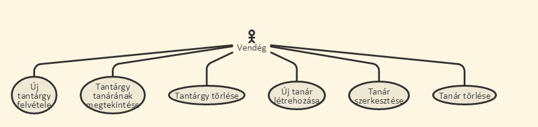

# Dokumentáció

##Követelmény analizis
###Funkcionális követelmények
- Lehessen a tantárgyakat megtekinteni --> Összes tantárgy
- Lehessen új tantárgyakat létrehozni és törölni --> Összes tantárgy
- Lehessen megtekinteni a tantárgyhoz tartozó oktatót. --> Összes tantárgy
- Lehessen az oktatókat megtekinteni --> Összes tanár
- Lehessen új oktatókat létrehozni, szerkeszteni és törölni --> Összes tanár
- Lehessen megtekinteni a tantárgyhoz tartozó oktatót. --> Összes tanár
- A főoldalon az alkalmazás ismertetése jelenik meg.

###Nem funkcionális követelmények
- Felhasználóbarát, ergonomikus elrendezés és kinézet.
- Gyors működés.

###Szerepkörök

- vendég: a főoldal tartalmához fér hozzá és tud új tanárokat és tantárgyakat létrehozni.

###Folyamatok

A fenti ábrán látható egy folyamat. A felhasználó megérkezik a főoldalra. Ezután átlép az összes tantárgy oldalra és létrehoz egy új tantárgyat.

A fenti ábrán látható egy másik folyamat. A felhasználó megérkezik a főoldalra, majd átlép az összes tanár oldalára és ott szerkeszt egy tanárt.

##Tervezés

###Oldaltérkép
Publikus:

- Főoldal
- Összes tantárgy
- Összes tanár

###Végpontok

- GET /: főoldal
- GET /subjects/list: bejelentkezes utani oldal
- GET /teachers/list: bejelentkező oldal
- POST /subjects/list: új tantárgy létrehozása és meglévő törlése
- POST /teachers/list: új tanár létrehozása és meglévő törlése
- GET /subjects/:teacherid: tantárgyhoz tartozó tanár megtekintése
- GET /teachers/:teacher_id: tanár szerkesztése
- POST /teachers/:teacher_id: tanár új adatai elküldése a szerver felé

###Adatbázisterv

A fenti kép ábrázolja az adatbázis tervet. Az adatbázis 2 táblából áll.
- Subject
- Teacher

A subject tábla tartalma:
- id : Elsődleges kulcs.
- subjectname : A tantárgy neve.
- description : Tantárgy leírása.
- credit : Tantárgy kreditértéke.

A teacher tábla tartalma:
- id : Elsődleges kulcs.
- firstname : A felhasználó keresztneve.
- lastname: A felhasználó vezetékneve.
- emailaddress : A felhasználó email címe.
- phonenumber : A felhasználó telefonszáma.

### Dinamikus működés

A képen látható a tanár szerkesztésének a szekvenciadiagramja.

##Tesztelés
A teszteléshez az ember.cli testerét használtam-
A teszteseteket megtekinthetők a https://bead3-staraise.c9users.io/tests oldalon, miután a szervert elindítottuk.
A tantárgy model egységtesztelésénél teszteltem hogy létretudunk-e hozni új tantárgyat.

##Felhasználói dokumentáció

###A futtatáshoz ajánlott hardver-, szoftver konfiguráció
A futtatáshoz ajánlott hardver: bármi amin elfut egy böngésző.
Ajánlott szoftver: Google Chrome

###Telepítés lépései
A felhasználó meglátogatja a https://github.com/staraise/bead3ember oldalt és onnan letölti a projektet. 

A felhasználó meglátogatja a https://github.com/staraise/bead3restapi oldalt és onnan letölti a projektet. 

Miután mindkét projektet letöltötte, cloud9-on külön workspace-t csinál mindkét projektnek majd a ide feltölti a két fájlt értelemszerűen.

####Rest api telepítése

A rest api kitömörítése után, a biztonság kedvéért futassuk le az npm install parancsot, majd ezután indítsuk el a server.js-t.
Ezekután a szerver sikeresen elindult.

###Az oldal használata

Amikor az oldalt meglátjuk vendégként akkor több opció közül választhatunk.

-Összes tantárgy megtekintése

Ha ezt a menüpontot választjuk akkor az oldal átirányít minket egy másik oldalra ahol tudunk új tantárgyat felvenni vagy megtekinteni az eddigi tantárgyakat. 

A tantárgyak mellett két funkció van. Az egyik a tanár megtekintése, ha erre a gombra kattintunk akkor megtudjuk az oktató adatait aki a tantárgyat tanítja.

A másik opció a törlés, ezzel az adott tantárgyat lehet törölni.

-Összes tanár megtekintése

Ha ezt a menüpontot választja a felhasználó akkor megtekintheti a tanárokat. Ugyanennél a menüpontnál lehetőség van új tanárt felvenni vagy meglévőt szerkeszteni vagy törölni.

